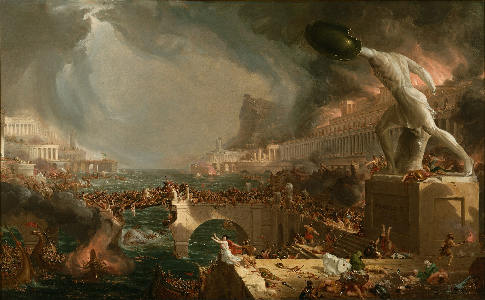

{width=100%}

Nothing natural is evil.

## Welcome

I'm Karn. 

I'm a Master of Data Science student at UBC. I hail from Toronto, ON in Canada and I studied Actuarial and Financial Mathematics in my undergraduate degree at McMaster University. 

I served as a reservist for three years in the Canadian Armed Forces before releasing with the rank of Bombardier. I also worked as a Management Trainee at Cintas for just over two years where I held roles in production, service, and sales. 

After MDS, I hope to work as a Data Scientist at an organization that utilizes data in an ethical and meaningful way. 

